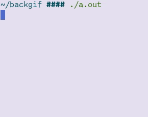
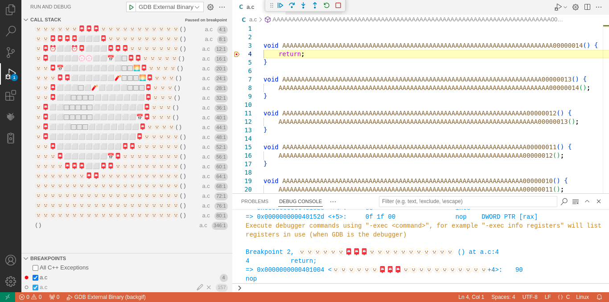
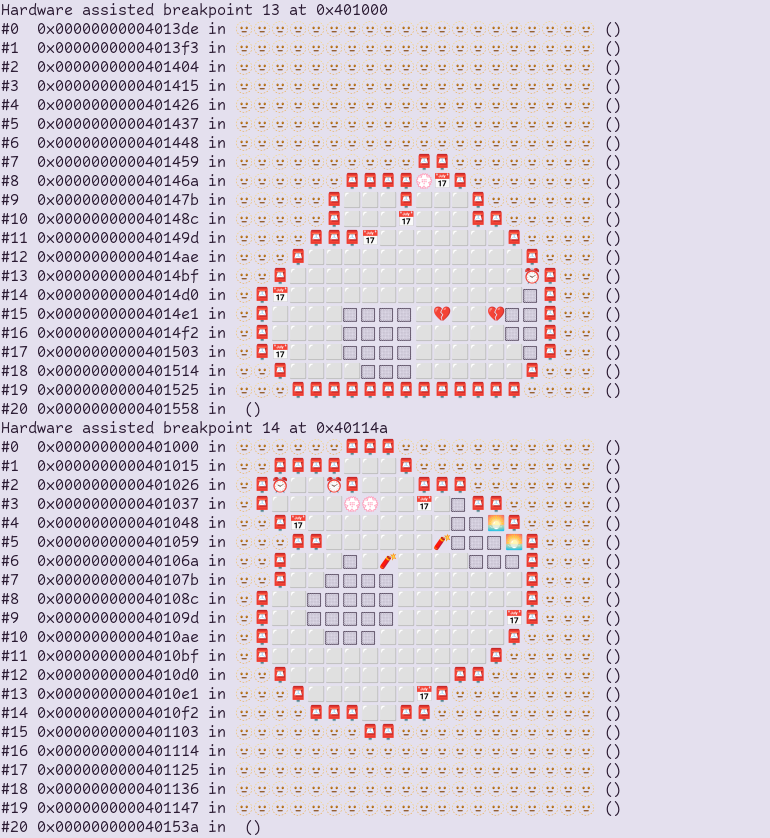

# backgif

A command-line program that rend-



Uh, hold on, let me debug this really quick:

https://github.com/user-attachments/assets/39dce172-7873-4a30-8051-59ae723667a8

That's better! As I was saying, this is a command-line program that renders animations in backtraces. Specifically, it writes an executable that will contain animation frames encoded in patched function name symbols.

As a creative challenge, running that executable follows a set of restrictions:

1. Renderer process cannot execute any syscalls [1];
2. Any external process must use built-in functionality to read memory and write to stdout. In particular:
    * Don't write to the renderer process [2];
    * Don't decorate any read memory (e.g. [GDB Frame Filters](https://sourceware.org/gdb/current/onlinedocs/gdb.html/Writing-a-Frame-Filter.html));

We can use a debugger to set a breakpoint on the renderer process, and show a backtrace when that breakpoint is hit, displaying exactly one animation frame. Then, it's only a matter of running and breaking very carefully over each frame.

People are conditioned to fear backtraces. Let's make them fun for once!

---

[1]: What if we want to update symbols at runtime? Symbol table sections are not loaded in process memory. Instead, we compile this executable twice, and on the second time, include the first executable in a custom section. The rendered process then modifies symbols stored in this custom section, which is then read directly by the external process, as if it was a regular binary with debugging data.

[2]: Unfortunately relaxed for current versions (up to 22) of LLDB, as software breakpoints need to be used due to [lack of Linux x86_64 target support for hardware breakpoints](#lackings).

## Requirements

Tested on x86_64-pc-linux-gnu (Debian 12, Linux 6.1.137) with the following dependencies:

* clang 20.1.8
* gcc 12.2.0
* gdb 13.1
* ld 2.40
* lldb 20.1.8
* rustc 1.89.0
* vscode 1.94.2

Optionally, for runtime validations:

* bpftrace 0.17.0
* strace 6.1

## Examples

For a list of available options: 

```sh
cargo run --release . --help
```

### GIF with terminal renderer

The introduction's animation is displayed on GDB, but we could use LLDB:

```sh
cargo run --release example/bunnyhop.gif
cargo run --release example/bunnyhop.gif -d lldb
```

Here's a larger example, where we redraw one line at a time to reduce possible flickering:

```sh
cargo run --release example/snake.gif --clear-line
cargo run --release example/snake.gif --clear-line -d lldb
```

https://github.com/user-attachments/assets/f47e6b18-a959-4e44-91a2-da764bad112d

### GIF with emoji renderer

What about graphical debuggers, such as Visual Studio Code? Since these don't handle terminal escape sequences, we can approximate each frame dot as emoji codepoints:

```sh
cargo run --release example/bunnyhop.gif --debug-info --renderer emoji
cargo run --release example/bunnyhop.gif --debug-info --renderer emoji -d lldb
```

A [custom run configuration](./.vscode/launch.json) must also be used, so that vscode uses the compiled binary to read debug symbols from, instead of compiling it's own binary.



How disappointing, the use of a proportional font ends up misaligning the emoji across function names. While we could stick to equal width glyphs, it would be quite limitating.

Of course, everything looks much better in the terminal, even without escape sequences to clear other characters!



### C with terminal renderer

Now that we've played with GIFs, why not try some procedurally generated graphics?

This one shows random tiles of colors every second:

```sh
# Allow mapping process memory at page zero, used for GDB symbol reloading.
echo 0 | sudo tee /proc/sys/vm/mmap_min_addr

cargo run example/rnd_dots.c --format c --width 10 --height 10
cargo run example/rnd_dots.c --format c --width 10 --height 10 --debug-info -d lldb
```

https://github.com/user-attachments/assets/ada4b397-996a-4828-9bcc-dac9a917cac6

And we could not end without an oldschool demoscene effect!

```sh
cargo run example/fire.c --format c --width 80 --height 50 --clear-line --delay 5
cargo run example/fire.c --format c --width 80 --height 50 --clear-line --delay 5 --debug-info -d lldb
```

https://github.com/user-attachments/assets/704c479e-a096-47c5-826f-081512e3e2a5

### Verifying restrictions

#### "Renderer process cannot execute any syscalls"

Since GDB uses ptrace(), strace can't also attach to the debuggee. There are workarounds involving [more complex setups](https://developers.redhat.com/blog/2020/03/16/extending-gdbserver-to-support-an-strace-client), but we can just use BPF instead:

```sh
bpftrace ./example/a_out_syscalls.bt
```

If we were calling libc's printf(), we would get several syscalls:

```
@[158]: 1
@[11]: 1
@[302]: 1
@[21]: 1
@[218]: 1
@[231]: 1
@[334]: 1
@[0]: 1
```

But our expected output is: none!

#### "Don't write to the renderer process"

Typically debuggers implement software breakpoints by temporarily patching the address where a breakpoint is set (in x86 it would be a single `0xCC` byte), then reverting it back once the debuggee hits the breakpoint.

In our GDB scripts, we can just use hardware breakpoints, which do not make these patches on memory, satisfying our self-imposed restriction. But what about stopping with `starti`, i.e. before the process executes any instruction? Does that also use breakpoints? Nope: GDB forks, and before the child process runs execve(), it calls ptrace() with `PTRACE_TRACEME`. In these conditions, the [kernel sends a `SIGTRAP`](https://github.com/torvalds/linux/blob/830b3c68c1fb1e9176028d02ef86f3cf76aa2476/include/linux/ptrace.h#L155) back to the parent process, so the end result is what we expect: the target is suspended.

These calls can also be traced with BPF:

```sh
bpftrace ./example/gdb_starti.bt
```

Example output:

```
[gdb(402171)] sys_enter_vfork()
[gdb(402177)] sys_exit_vfork(pid=0)
[gdb(402177)] sys_enter_ptrace(req=0 pid=0 addr=0 data=0)
[gdb(402177)] sys_enter_execve(filename=/home/fn/code/my/backgif/a.out)
[gdb(402171)] sys_exit_vfork(pid=402177)
[a.out(402177)] send_sig(sig=5 pid=402177 priv=0 ret=51)

        send_sig+1
        bprm_execve+1568
        do_execveat_common.isra.0+429
        __x64_sys_execve+50
        do_syscall_64+85
        entry_SYSCALL_64_after_hwframe+110
```

And to confirm that our scripts aren't manipulating the renderer process memory:

```sh
bpftrace ./example/gdb_proc_mem_writes.bt
```

If we were using software breakpoints, we would see the patched bytes being set, then reverted:

```
gdb: openat file=/proc/800443/task/800443/mem candidate pid=800443
gdb: write fd=16 buf=\xcc @ 00401000
gdb: write fd=16 buf=\xcc @ 0040114a
gdb: write fd=16 buf=U @ 00401000
gdb: write fd=16 buf=U @ 0040114a
```

These in particular could also be seen with strace:

```sh
strace -x -p $(pgrep gdb) 2>&1 | grep '^pwrite64'
```

```
pwrite64(14, "\xcc", 1, 4198404)        = 1
pwrite64(14, "\xcc", 1, 4198511)        = 1
pwrite64(14, "\xc7", 1, 4198404)        = 1
pwrite64(14, "\xb8", 1, 4198511)        = 1
```

## Findings

Mapping memory at page zero reproduces a [bug on LLDB that duplicates module listings](https://github.com/llvm/llvm-project/issues/153772).

We can also make GDB segfault 😆! Still needs further investigation before opening a bug, but it seems easier to reproduce with:

* more recent versions (e.g. 16.3);
* frontend plugin (e.g. [pwndbg 2025.05.30](https://github.com/pwndbg/pwndbg));
* executables generated with `--debug-info`;

Either letting it run, or breaking with Ctrl-C and continuing execution, will gift us with a (garden-variety) backtrace:

```
Fatal signal: Segmentation fault
----- Backtrace -----
0x5587fc600e02 gdb_internal_backtrace_1
        /opt/gdb-16.3/gdb/bt-utils.c:121
0x5587fc600e02 _Z22gdb_internal_backtracev
        /opt/gdb-16.3/gdb/bt-utils.c:182
0x5587fc70feec handle_fatal_signal
        /opt/gdb-16.3/gdb/event-top.c:1018
0x5587fc71007c handle_sigsegv
        /opt/gdb-16.3/gdb/event-top.c:1089
0x7f067545b04f ???
        ./signal/../sysdeps/unix/sysv/linux/x86_64/libc_sigaction.c:0
0x5587fc5ddc9d _Z22bpstat_explains_signalP6bpstat10gdb_signal
        /opt/gdb-16.3/gdb/breakpoint.c:4713
0x5587fc793373 handle_signal_stop
        /opt/gdb-16.3/gdb/infrun.c:7124
0x5587fc7941dd handle_stop_requested
        /opt/gdb-16.3/gdb/infrun.c:5115
0x5587fc7941dd handle_stop_requested
        /opt/gdb-16.3/gdb/infrun.c:5110
0x5587fc7941dd handle_inferior_event
        /opt/gdb-16.3/gdb/infrun.c:6574
0x5587fc795acc _Z20fetch_inferior_eventv
        /opt/gdb-16.3/gdb/infrun.c:4702
0x5587fcafba25 gdb_wait_for_event
        /opt/gdb-16.3/gdbsupport/event-loop.cc:694
0x5587fcafc1f6 _Z16gdb_do_one_eventi
        /opt/gdb-16.3/gdbsupport/event-loop.cc:216
0x5587fc7dc929 start_event_loop
        /opt/gdb-16.3/gdb/main.c:402
0x5587fc7dc929 captured_command_loop
        /opt/gdb-16.3/gdb/main.c:466
0x5587fc7df3c4 captured_main
        /opt/gdb-16.3/gdb/main.c:1343
0x5587fc7df3c4 _Z8gdb_mainP18captured_main_args
        /opt/gdb-16.3/gdb/main.c:1362
0x5587fc5573c7 main
        /opt/gdb-16.3/gdb/gdb.c:38
---------------------
A fatal error internal to GDB has been detected, further
debugging is not possible.  GDB will now terminate.

This is a bug, please report it.  For instructions, see:
<https://www.gnu.org/software/gdb/bugs/>.

zsh: segmentation fault  gdb -q ./a.out --command a_gdb.py
```

## Lackings

If LLDB doesn't support hardware breakpoints in your target, it gives the following error when setting one of them:

```
warning: failed to set breakpoint site at 0x401000 for breakpoint 10.1: error: 9 sending the hardware breakpoint request (hardware breakpoint resources might be exhausted or unavailable)
```

To better understand what's going on, we can [compile LLDB with debug info](https://lldb.llvm.org/resources/build.html) and, well, debug some relevant functions:

```sh
gdb ./llvm-project/bin/lldb-server \
    -ex 'set follow-fork-mode parent' \
    -ex 'b GDBRemoteCommunicationServer::GetPacketAndSendResponse' \
    -ex 'b GDBRemoteCommunicationServerLLGS::Handle_Z' \
    -ex 'b NativeProcessProtocol::SetHardwareBreakpoint' \
    -ex 'b NativeProcessProtocol::GetHardwareDebugSupportInfo' \
    -ex 'r gdbserver :1234 a.out'
./llvm-project/bin/lldb \
    --one-line 'platform select remote-linux' \
    --one-line 'gdb-remote 1234'
```

Stepping through these calls, we end up in an instance of `NativeRegisterContextLinux_x86_64`, which does not override some superclass methods, such as `NativeRegisterContext::NumSupportedHardwareBreakpoints()`, which [defaults to 0](https://github.com/llvm/llvm-project/blob/01f36b39bd2475a271bbeb95fb9db8ed65e2d065/lldb/source/Host/common/NativeRegisterContext.cpp#L241).

So this value is returned to `NativeProcessProtocol::GetHardwareDebugSupportInfo()`, [failing the check](https://github.com/llvm/llvm-project/blob/01f36b39bd2475a271bbeb95fb9db8ed65e2d065/lldb/source/Host/common/NativeProcessProtocol.cpp#L251) on `NativeProcessProtocol::SetHardwareBreakpoint()`, bubbling up an error that results in `GDBRemoteCommunicationServerLLGS::Handle_Z` [sending the mystifying error `0x09`](https://github.com/llvm/llvm-project/blob/01f36b39bd2475a271bbeb95fb9db8ed65e2d065/lldb/source/Plugins/Process/gdb-remote/GDBRemoteCommunicationServerLLGS.cpp#L2907).

That's why our LLDB scripts use software breakpoints!

Funnily enough, it's not the first time someone has to [take a trip down LLDB internals to find hardware breakpoint stubs](https://reverse.put.as/2019/11/19/how-to-make-lldb-a-real-debugger/).

## Acknowledgements

* `fire.c` modified from [The Old-School Fire Effect and Bare-Metal Programming](https://www.hanshq.net/fire.html);
* `rnd_dots.c` modified from [Seiran128 v1 - pseudorandom number generator](https://github.com/andanteyk/prng-seiran/blob/master/seiran128.c);
* `bgr_to_emoji.json` modified from [emojEncode](https://github.com/Ophelia-Heyes/emojEncode), under [GPL3 License](./LICENSE.GPL3);
* Remaining files under [MIT License](./LICENSE);
